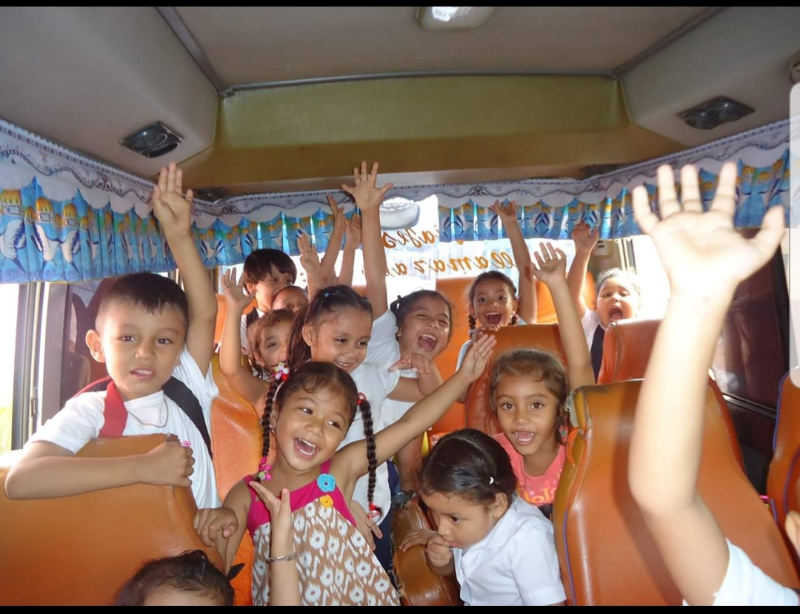
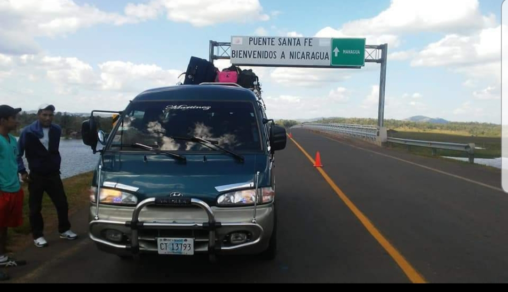

# Transporte Martinez #


## Autor ##
Francisco Javier Martinez

## Tecnologias ##

* Css
* JavaScript
* HTML5
* Markdown

## Descripcion ##

Esta pagina web esta diseñada para los clientes de Transporte Martinez. Para conocer un poco mas de nuestros servicios hacemos de tus viajes una hermosa experiensia conociendo nuestro territorio Nacional. Cuneta con menu donde puedes ver imformacion necesaria y un poco de imagenes de nuestro hermosa tierra.

``` html
 <div class="navbar-fixed">
    <nav class="red">
      <div class="nav-wrapper">
        <div class="container">
          <a href="#" class="brand-logo">Bienvenidos a</a>
          <a href="#" data-activates="mobile-menu" class="button-collapse"><i class="material-icons">menu</i></a>
          <ul class="right hide-on-med-and-down">
            <li><a href="#">Información</a></li>
            <li><a href="#">Producto </a></li>
            <li><a href="#">Galeria</a></li>
            <li><a href="#">Contacto</a></li>
          </ul>
        </div>
      </div>
    </nav>
  </div>
  <ul class="side-nav" id="mobile-menu">
    <li><a href="#">Información</a></li>
    <li><a href="#">Producto</a></li>
    <li><a href="#">Galeria</a></li>
    <li><a href="#">Contacto</a></li>
  </ul>
  ```
  Posterior mente tenemos la siguiente seccion del slider con imagenes que hacen referencia a nuestra empresa.

  ```html
  <li>
       
      <div class="caption center-align">
      
        
      </div>
    </li>
    <li>
       
      <div class="caption left-align">
        <h3 class="blue-text">Les Ofreceremos:</h3>
        <h5 class="light black-text text-lighten-3">Viajes turisticos dentro y fuera del territorio Nacional.</h5>
      </div>
    </li>
    <li>
       
      <div class="caption right-align">
        <h3  class="green-text">Tambien servico de rrecorrido Escolar!</h3>
        <h5 class="light green-text text-lighten-3">Preescolar y Primaria.</h5>
      </div>
    </li>
    ```
    contamos con nuestro siguiente menu en donde puedes hacer tu reservacion con nosotros y en donde te puedes contactar directamente con la empresa.

    ``` html
    <section class="container">
  <div class="row center">
    <div class="col s4">
      <i class="material-icons large green-text">flash_on</i>
      <h4>Reservacion</h4>
      <p>Reserva con nosotros.</p>
    </div>
    <div class="col s4">
      <i class="material-icons large green-text">group</i>
      <h4>Contacto</h4>
      <p>Contactanos y cuentanos tu experiencia.</p>
    </div>
    <div class="col s4">
      <i class="material-icons large green-text">settings</i>
      <h4>Configuraciones</h4>
      <p>Configura y filtra tus busquedas.</p>
    </div>
  </div>
</section>
```
en el siguiente menu contamos con una galeria de fotos de algunos lugares turisticos de nuestro territorio nacional.

``` html
<section>
  <div class="container">
    <div class="row">
        <h4 class="center indigo-text">viajes turisticos</h4>
      <div class="col s12 m4">
        <div class="card">
          <div class="card-image">
            
            <span class="card-title">parque de granada</span>
          </div>
          
        </div>
      </div>
      <div class="col s12 m4">
          <div class="card">
            <div class="card-image">
              
              <span class="card-title">playa marsella</span>
            </div>
            
          </div>
        </div>
        <div class="col s12 m4">
            <div class="card">
              <div class="card-image">
                
                <span class="card-title">playa poneloya</span>
              </div>
              
            </div>
          </div>
        </div>
      </div>


     
</section>
```
contamos con una barra en donde puedes agregar tus comentarios y experiensias con nosotros como empresa.

```html
<div class="col s12 center">
      <a class="btn btn-large red"><i class="material-icons left">send</i>Envia tus comentarios</a>
    </div>
    ```
    te invitamos aque nos sigas en nuestras redes para que puedas ver de que se trata nuestro servicio

    ```html
    <section class="indigo white-text center siguenos">
  <div class="container">
    <div class="row">
      <div class="col s12">
        <h4>Siguenos en nuestras redes</h4>
        <p>conoce nuestros servicios y las ofertas especiales</p>
      </div>
    </div>
  </div>
</section>
```
en el siguiente menu te damos la facilidad de llenar una lista con tus datos necesarios para que puedas contactarte con nosotros.

```html
<section>
  <div class="container">
    <h4 class="center indigo-text">Contacto con nosotros</h4>
    <div class="row">
      <form>
        <div class="input-field col s12 l6">
          <input type="text" id="primer_nombre" class="validate">
          <label for="primer_nombre">Primer Nombre</label>
        </div>
        <div class="input-field col s12 l6">
          <input type="text" id="segundo_nombre" class="validate">
          <label for="segundo_nombre">Segundo Nombre</label>
        </div>
        <div class="input-field col s12">
          <input type="email" id="email" class="validate">
          <label for="email" data-error="Correo Inválido" data-success="Correcto">Email</label>
        </div>
        <div class="input-field col s12">
          <textarea id="mensaje" class="materialize-textarea"></textarea>
          <label for="mensaje">Mensaje</label>
        </div>
        <button class="btn waves-effect waves-light blue" type="submit" name="action">Enviar
          <i class="material-icons right">send</i>
        </button>
      </form>    
    </div>
  </div>
</section>